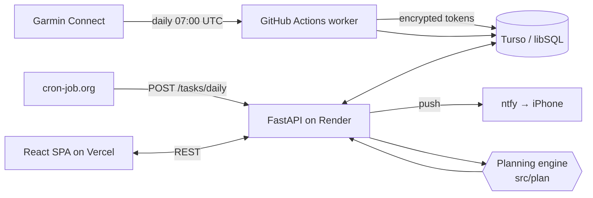

<h1 align="center">athlete.</h1>

<p align="center">
  <b>An adaptive training planner for hybrid athletes — marathon running + strength — built on my own Garmin data.</b>
</p>

<p align="center">
  <a href="https://athlete-app-kohl.vercel.app"><b>Live app</b></a> ·
  <a href="docs/ARCHITECTURE.md"><b>Architecture</b></a> ·
  <a href="#the-planning-engine"><b>Planning engine</b></a>
</p>

<p align="center">
  
  
  
  
  
  
  
</p>

---

## Why this exists

Generic training apps give you a running plan *or* a lifting plan. They do not know that a heavy leg day on Friday
makes Saturday's interval session physiologically pointless, that a week with a 30% HRV drop is not the week to add
volume, or that the menstrual cycle changes what a hard week should look like.

I am training for a marathon while keeping three strength sessions a week, so I built the tool I could not buy:
a planner that reads my Garmin data every morning, combines it with what I log in plain language, and rewrites the
week according to an explicit, auditable set of training rules.

It is not a toy. It has generated the real plan I train on since March 2026 — **550+ commits**, two daily users,
deployed and running in production on free-tier infrastructure.

## What it does

| | |
|---|---|
| **Automatic Garmin ingest** | A GitHub Actions job pulls activities, sleep, HRV and resting HR every morning using stored, encrypted session tokens — no password kept anywhere. |
| **Natural-language training diary** | *"10k super easy, bench 3×6 @ 8kg, felt weak so keep the weight, curls 3×6 @ 8kg, great, go up next week."* The entry is matched against the Garmin activity of that day and the strength history, so the app knows what to prescribe next week. |
| **Rule-based weekly plan generation** | A deterministic Python engine builds the week from the macrocycle phase, last week's real load, the injury catalogue, and biometric readiness. |
| **Strength progression memory** | Per-exercise set/rep/weight history drives the suggested load for the next session. |
| **Readiness "traffic light"** | HRV, sleep and resting HR are combined into a green/amber/red signal that scales or cuts the day's session. |
| **Cycle-aware planning** | Menstrual-cycle phase and symptoms feed the volume suggestion — the model *suggests*, the athlete decides via a manual slider. |
| **Plan audit** | Every generated week is checked against the rules (80/20 intensity split, long-run share, ≤10% weekly progression, 48h between quality sessions) and shown as pass/warn/fail in the UI. |
| **Morning push notification** | The day's session arrives on the phone at 9:00 via `ntfy`. |

## How it works



Three deliberate decisions worth calling out:

- **The planning engine is pure Python and has no I/O.** Rules live in `src/plan/*`, take plain dicts and
  DataFrames, and return a plan. That is what makes the training logic testable and what keeps it out of the
  request handlers.
- **Generation is deterministic, not generative.** An LLM is a bad fit for "does this week violate the 10% rule";
  the rules are code. Language models are only ever used to *phrase* a session description, never to decide it.
- **Free tier everywhere, by design.** Vercel + Render free dyno + Turso free tier + GitHub Actions. The 07:00
  sync doubles as a warm-up call so the API is awake before the 09:00 notification.

See [`docs/ARCHITECTURE.md`](docs/ARCHITECTURE.md) for the data model, the request flow and the deployment topology.

## The planning engine

This is the part I would want reviewed. ~3.5k lines of rules in `src/plan/`, each module isolated and unit-testable:

| Module | What it encodes |
|---|---|
| `motor.py` | Builds the week: fixed day distribution (Pull / Quality / Push / Easy / Legs / Recovery / Long run), session constructors. |
| `reglas.py` | Macrocycle phases, HRV/sleep traffic light, heart-rate zones, injury catalogue and the restrictions each injury imposes, weekly volume ceilings. |
| `adaptador_semanal.py` | What to do when sessions are *missed* — priority ordering (long run > tempo > intervals > easy), re-entry rules after 2+ missed days, 48h spacing between quality sessions. |
| `interferencia_detector.py` | The strength↔endurance interference "dead zone": hypertrophy rep ranges next to 95%-effort running cancels adaptations. Flags and reschedules the collision. |
| `gas_progression.py` | General Adaptation Syndrome phase (alarm / resistance / exhaustion) inferred from HRV, sleep, stress and recovery trend. |
| `menstrual_cycle_gas_sync.py` | Combines cycle phase with the GAS phase into a volume suggestion, with an explicit athlete override. |
| `memoria_fuerza.py` | Strength progression: per-phase rep schemes and next-session load from logged history. |
| `protocolo_selector.py` | Picks Protocol A (strength-priority) vs B (true hybrid) from the macrocycle phase and ACWR. |
| `plan_integrator.py` | Orchestrates all of the above into one enriched plan. |

The rules are not invented: they come from a written training protocol
(`NORMAS_ENTRENAMIENTO_v2.docx`, plus the marathon methodology in `docs/`) that the code is meant to implement
faithfully. Changing a rule means changing that document first.

## Tech stack

**Frontend** — React 18 · TypeScript · Vite 6 · Tailwind 4 · shadcn/ui (Radix) · MUI · React Router 7 (route-level
code splitting) · Recharts · dnd-kit for drag-and-drop plan editing. Dark theme only, mobile-first shell.

**Backend** — FastAPI · Pydantic v2 + `pydantic-settings` · APScheduler · SQLite locally / Turso (libSQL over HTTP)
in production · Docker.

**Integrations** — `garminconnect` (unofficial Garmin API) with encrypted token storage · `ntfy.sh` push ·
`cron-job.org` as external scheduler.

**Ops** — GitHub Actions (daily Garmin worker, Vercel deploy) · Render (containerised API) · Vercel (SPA).

**Size** — ~13k lines of Python, ~15.6k lines of TypeScript/TSX (excluding vendored shadcn primitives).

## Repository layout

```
Figma/                  React SPA (Vite). src/app/{pages,components,context}, api.ts is the single API boundary
backend-fastapi/        FastAPI service — 7 routers, ~50 endpoints, Turso/SQLite layer, APScheduler jobs
  routers/              auth · dashboard · plan · garmin · diario · ejercicios · entrenador
src/plan/               Training rule engine (pure Python, no I/O)
src/db/                 Data access + models shared by the engine
scripts/                One-off migration and maintenance scripts (SQLite → Turso, token upload, dedupe)
tests/                  Pytest suites
docs/                   Architecture notes and the training methodology
.github/workflows/      Daily Garmin sync · Vercel deploy
```

## Running it locally

```bash
# 1. Backend
cd backend-fastapi
python -m venv venv && source venv/bin/activate      # Windows: venv\Scripts\activate
pip install -r requirements.txt
cp .env.example .env                                 # leave TURSO_* empty to use local SQLite
uvicorn main:app --reload --port 8000

# 2. Frontend
cd Figma
npm install
echo "VITE_API_URL=http://localhost:8000" > .env.local
npm run dev
```

App at `http://localhost:5173`, interactive API docs at `http://localhost:8000/docs`.

## API

Seven routers, all under the service root — `POST /auth/login`, `GET /dashboard/{user}`,
`GET /plan/{user}/semana/{date}`, `POST /plan/{user}/generar-semana`, `POST /garmin/{user}/sync`,
`GET|POST /diario/fisiologia`, `GET|POST /ejercicios/...`, `GET /entrenador/{user}/resumen`, plus
`/health` and the cron-protected `/tasks/daily`.
Full generated reference: `http://localhost:8000/docs` (OpenAPI).

## Tests

```bash
cd backend-fastapi && pytest        # API smoke tests + planning-rule tests
```

`tests/test_plan_v2.py` is the interesting one: it asserts the training rules hold for generated weeks
(day distribution, leg-day/quality collision, deload weeks, long-run share).

## Known limitations

- Garmin integration relies on an unofficial API; it breaks when Garmin changes things, which is why tokens are
  stored and refreshed rather than re-authenticating on every run.
- Two hard-coded users — the app was built for a specific pair of athletes, not as a multi-tenant product.
  Proper auth is the first thing to add if it ever went public.
- `src/garmin/` and `src/core/` are not published in this repository; the live sync path is
  `backend-fastapi/routers/garmin.py`.
- The landing page still renders seeded sample sessions before hydrating from the API.

## License

MIT — see [LICENSE](LICENSE).
