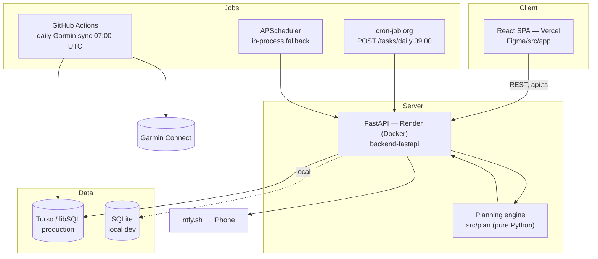
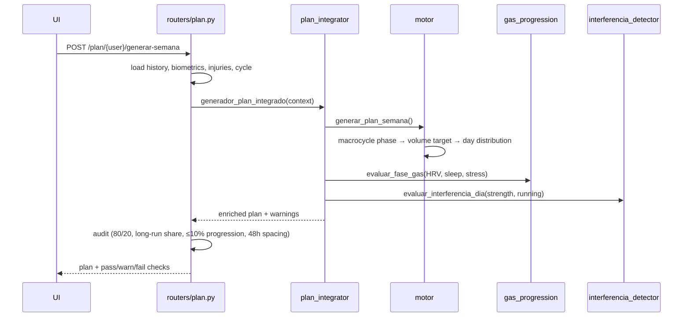

# Architecture

How `athlete.` is put together, and why. Read this before changing anything structural.

## 1. System overview



## 2. Layers and what belongs in each

| Layer | Path | Rule |
|---|---|---|
| UI | `Figma/src/app/pages`, `components` | No `fetch` in components. Every call goes through `api.ts`. |
| API boundary | `Figma/src/app/api.ts` | One typed function per endpoint. Single place that knows the base URL. |
| HTTP | `backend-fastapi/routers/*` | Request/response shaping, validation, persistence orchestration. No training rules. |
| Domain | `src/plan/*` | Training rules. Pure functions over dicts/DataFrames — **no DB access, no HTTP, no env vars**. |
| Data | `backend-fastapi/database.py`, `src/db/*` | Connection handling, schema, queries. |

The domain/HTTP split is the point of the whole layout: the training rules are the hard, interesting,
frequently-wrong part, so they are kept where they can be called from a test with a literal dict.

## 3. The database layer

Production runs on **Turso** (libSQL). Turso's client libraries were awkward on the target runtime, so
`backend-fastapi/database.py` implements a small **DB-API-shaped client over Turso's hrana HTTP pipeline
protocol** (`POST {url}/v2/pipeline`): `TursoHTTPConnection` / `_TursoCursor` expose `execute`, `fetchone`,
`fetchall`, `commit`, context-manager support.

Because that shim mimics `sqlite3`, the rest of the codebase is storage-agnostic: `get_db()` returns a real
`sqlite3.Connection` locally and the HTTP-backed one in production, and no caller has to care. Integer arguments
are marshalled as strings because the hrana wire format requires it.

### Schema (18 tables)

| Group | Tables |
|---|---|
| Identity | `usuarios` (profile, encrypted Garmin tokens) |
| Plan | `plan_entrenamiento`, `macrociclo_overrides`, `ciclo_overrides` |
| Garmin | `actividades_garmin`, `actividades_garmin_excluidas`, `datos_biometricos_premium`, `datos_sueno` |
| Diary | `diario_fisiologia`, `historial_ciclos_menstruales`, `lesiones` |
| Strength | `sesiones_fuerza`, `ejercicios_fuerza`, `ejercicios_biblioteca`, `ejercicios_catalogo`, `historial_ejercicio` |
| Field tests | `sweat_rate_tests`, `intra_entreno_tests` |

`init_db()` is idempotent (`CREATE TABLE IF NOT EXISTS` + additive migrations), so a cold start on an empty
database bootstraps itself.

## 4. Garmin ingestion

Garmin has no public API, so the app drives `garminconnect`. Two constraints shaped the design:

1. **Rate limiting by IP.** Cloud platforms share egress IPs and Garmin returns 429s. Sync therefore runs from a
   GitHub Actions runner on its own schedule, not from a user request.
2. **No password storage.** The login happens once, locally; the resulting session tokens are encrypted and stored
   in `usuarios.garmin_tokens`. The daily worker decrypts and reuses them (`ENCRYPTION_KEY` is a repository secret).

```
07:00 UTC  GitHub Actions → garmin_worker_cloud.py → Garmin → Turso
09:00 ES   cron-job.org   → POST /tasks/daily (X-Cron-Secret) → sync + ntfy push
```

The 07:00 job also wakes the Render free dyno so the 09:00 notification is not served by a cold start.

`POST /tasks/daily` and `/tasks/garmin-sync` are protected by a shared secret header rather than user auth,
because the caller is a scheduler, not a person.

## 5. Plan generation flow



The audit step runs on the *generated* output rather than being assumed from the generator — a week that violates
a rule is surfaced in the UI instead of silently shipped.

## 6. Deployment

| Piece | Where | Trigger |
|---|---|---|
| SPA | Vercel (`athlete-app-kohl.vercel.app`) | `.github/workflows/frontend-deploy.yml` on push to `Figma/**` |
| API | Render, Docker (`render.yaml`, service `athlete-api`) | push to `main` |
| DB | Turso | — |
| Garmin worker | GitHub Actions (`garmin-worker.yml`) | cron `0 7 * * *` + manual dispatch |
| Daily task | cron-job.org → `POST /tasks/daily` | 09:00 Europe/Madrid |

CORS is pinned to the Vercel production domain plus a `*.vercel.app` regex for preview deployments.

## 7. Configuration

| Variable | Where | Purpose |
|---|---|---|
| `TURSO_DATABASE_URL` / `TURSO_AUTH_TOKEN` | API, worker | Empty ⇒ local SQLite |
| `LOCAL_DB_PATH` | API | SQLite file for development |
| `CORS_ORIGINS` | API | JSON array or comma-separated list |
| `NTFY_TOPIC` | API | Push topic; empty disables notifications |
| `CRON_SECRET` | API | Shared secret for `/tasks/*` |
| `ENCRYPTION_KEY` | Actions secret | Decrypts stored Garmin tokens |
| `VITE_API_URL` | SPA build | API base URL |

## 8. Frontend routing

All routes except `/` are registered with `lazy: () => import(...)` in `routes.ts`, so the initial bundle is just
the landing shell. `UserContext` holds the active user (persisted in `localStorage`); the header switches between
them, and cycle-related views are gated on the user id.

## 9. Conventions

- New endpoint ⇒ add to the router **and** to `Figma/src/app/api.ts`; never call `fetch` from a component.
- New route ⇒ add to `routes.ts` (lazy) **and** to `Header.tsx` if it belongs in the nav.
- Training rules change ⇒ update the methodology document first, then `src/plan/`, then the tests.
- Dark theme only. Accent `#C9FF00`, background `#0E1117`, cards `#161B22`.
